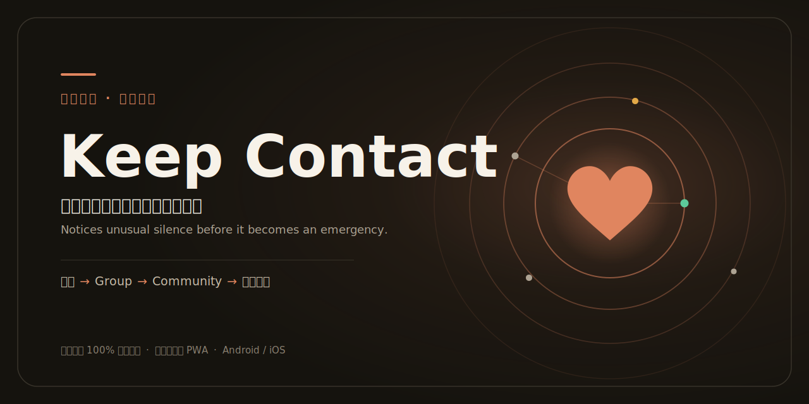

<p align="center">
  
</p>

# Keep Contact

「异常沉默」主动关怀 App —— 在保护隐私的前提下被动感知独居/健康受限用户的"生命迹象"，
当出现与日常作息突兀不符的**异常沉默**时，逐级提醒本人 → Group → Community → 终极救援触达，
避免因无人察觉而造成可挽救的悲剧。

完整设计见 `docs/`（plan 文件）。核心原则：**行为数据与判断 100% 留在本机**，
服务器只做身份/关系/升级计时/通知中转，以及仅在告警升级时对授权响应者解锁地址与紧急信息。

## 技术形态

- **Hybrid**：React + Vite（Web UI）通过 **Capacitor** 打包为 Android / iOS 原生 App。
- 被动信号靠原生插件（运动/步数、App 互动、Android 解锁事件）。
- 双端同时为目标。

## 开发

```bash
npm install        # 安装依赖
npm run dev        # 本地 Web 开发 (Vite)
npm run build      # 构建 Web 产物到 dist/
npm run typecheck  # 类型检查
npm test           # 运行单元测试 (Vitest)
```

## 原生（Capacitor）

```bash
npm run build              # 先产出 dist/
npx cap sync               # 同步 Web 产物与插件到原生工程
npx cap open android       # 用 Android Studio 打开并运行
```

- **Android**：工程已生成在 `android/`（需 Android Studio / SDK 构建运行）。
- **iOS**：CocoaPods 仅限 macOS，请在 Mac 上执行 `npx cap add ios` 后再 `npx cap open ios`
  （`@capacitor/ios` 依赖与 `capacitor.config.ts` 已就绪）。

## 线上地址（Vercel 托管前端）

- **生产**：https://keep-contact-mauve.vercel.app （iOS Safari 打开 → 分享 → 添加到主屏幕，即可像 App 一样使用）
- 部署：`vercel deploy --prod`（项目已 link 到 `vinzastudio-3665s-projects/keep-contact`，env 已配 `VITE_SUPABASE_*`）
- 注意：Vercel 只托管静态前端；所有数据/逻辑仍在 Supabase。

## 后端（Supabase）

- 项目：`KeepContact`（ref `byekgmqyqlftgoveqnku`，区域 ap-southeast-2）。
- Schema/RLS 迁移在 `supabase/migrations/`，通过 Supabase MCP 应用并已用 advisors 体检。
- 客户端配置：复制 `.env.example` 为 `.env` 填入 URL + publishable key（已在本地 `.env` 配好）。
- 生成类型：`npx supabase gen types typescript --project-id byekgmqyqlftgoveqnku`（已存于 `src/lib/database.types.ts`）。

> **开发用 demo 账号**（仅限本地探索，正式前请删除）：`demo@keepcontact.test` / `demo123456`。
> 真实邮箱注册若开启了"Confirm email"，需在 Supabase 控制台 Auth 设置中关闭，或点确认邮件后再登录。

### Social 登录（Google / Apple / Facebook）

客户端已接 `signInWithOAuth`，按钮已在登录页。**每个提供商需在 Supabase 控制台启用并填入密钥**才可用：

1. 各平台创建 OAuth 应用，回调地址一律填：`https://byekgmqyqlftgoveqnku.supabase.co/auth/v1/callback`
   - Google：Google Cloud Console → OAuth consent screen → Credentials → OAuth Client ID (Web)。免费。
   - Facebook：Meta for Developers → 创建应用 → Facebook Login。免费。
   - Apple：需 Apple Developer Program（$99/年），Services ID + Key。可后置。
2. Supabase → Authentication → Sign In / Providers → 启用对应 provider，填 Client ID/Secret。
3. Supabase → Authentication → URL Configuration：Site URL 与 Redirect URLs 加 `https://keep-contact-mauve.vercel.app`。

### PWA + Web Push（iOS 16.4+）

- `public/manifest.webmanifest` + `public/sw.js` + 图标；iOS 需**先添加到主屏幕**才能开启推送。
- 订阅流程：通知卡顶部「开启推送通知」按钮（iOS 要求用户手势）→ 订阅存 `push_subscriptions`。
- 发送链路：升级引擎写 `notifications` → **pg_cron 每分钟调 Edge Function `push-dispatch`**（pg_net）扫描未推送的并经 VAPID 发送（SOS 由客户端即时 invoke 加速）；SW 收到后按设备语言本地化展示。
- VAPID：公钥在 `VITE_VAPID_PUBLIC_KEY`；私钥在 `private.app_config`（测试期，经 service-role RPC 读取；正式前建议移到 Edge Function Secrets 并轮换）。

### 多语言

中英双语（`src/lib/i18n.tsx`）：自动跟随系统语言，登录页/首页右上角可手动切换（持久化）。
通知文本由服务器写入结构化 `params`、客户端按语言渲染（`notifications.params`）。

## 进度

- [x] **P0** 脚手架：React+Vite+TS + Capacitor（Android 已加），Web 构建与类型检查通过。
- [x] **P1** 账号 + 关系：邮箱密码登录、Community/Group 创建与邀请码加入、监护方向（被守望/守望他人）开关、守护人（守护码邀请 + 撤销）、紧急信息/住址录入。全部端到端验证（含 RLS 隔离、触发器、join/guardian RPC、守护人可读被守护者紧急信息）。
- [x] **P2** 信号 + 基线：时段感知统计基线判断引擎（14 个单元测试覆盖学习期/冷启动/基线判定/时段感知/灵敏度/安静窗）、IndexedDB 本地时序、Web 互动信号源、localStorage 配置、首页 LivenessCard（实时状态 + 报平安打卡 + 灵敏度档 + 安全但不在）。已浏览器验证。
  - 待真机：原生信号源（运动/步数 Health、Android 解锁）已留接口（`src/features/signals/sources.ts`），需装插件 + 真机/模拟器接入；周期性安静窗（睡眠作息）引擎已支持，仅缺 UI。
- [x] **P3** 本地告警闭环 + 心跳：告警自证遮罩（pattern 九宫格手势，解不开则不解除）、`send_heartbeat` 设备心跳（G1 设备侧）、`resolve_my_alert` 自解除。浏览器验证。
- [x] **P4** 服务器升级时钟 + 救援触达：`process_escalations` pg_cron 每分钟跑，self→group→community→terminal 服务器权威升级；两段式确认（`ack_alert` 暂停 / `resolve_alert` 解除）；暗设备（心跳中断）兜底；站内通知 feed；G3 紧急信息按 RLS 在告警升级时对授权响应者解锁。SQL + 浏览器（双人场景）验证。
- [x] **P5** SOS：超大按钮 → `raise_sos` 立即 group 阶段并通知守望者。浏览器验证。

## 双人配合测试（浏览器即可，无需真机）

1. 你和朋友各用一个浏览器，分别注册账号（或用 demo 账号 + 朋友新注册）。
2. 一方在「用邀请码加入」里用另一方的 Group 邀请码加入同一 Group（在"我的 Group"卡片可见邀请码）。
3. 确认双方在该 Group 的"被守望/守望他人"开关按需打开。
4. 被守护的一方点 **SOS**，或等其"异常沉默"触发（可在设置里把灵敏度调到"敏感"加速）。
5. 守望方会在"通知"卡片看到告警，可点 **我去联系**（暂停升级）/ **已确认安全**（解除）；告警升级到 group+ 时会看到对方解锁的住址与紧急联系电话。
6. 升级计时由服务器 pg_cron 每分钟推进（self 30 分钟 → group 1 小时 → community 2 小时 → terminal）。

## 待真机 / 待接（iOS 在 Mac 上完成）

- **iOS 原生壳**：在 Mac 上 `npx cap add ios` → Xcode 构建。Windows 无法编译 iOS。
- **被动信号（iOS）**：运动/步数（HealthKit）需原生插件接入 `src/features/signals/sources.ts` 的 `startNativeSources`；iOS 拿不到解锁事件。
- **后台心跳 / 推送**：浏览器/前台已发心跳；iOS 后台心跳需原生 + 静默推送，告警通知需 APNs。当前用站内通知 feed 兜底（前台可见）。
- **多通道兜底（G4）**：Push + 短信 + 语音需接 APNs/FCM + Twilio（服务器侧），当前为站内通知。
- **Supabase 控制台建议**：Auth 设置里开启 "Confirm email"（正式）或关闭（开发顺滑）；并建议开启 "Leaked password protection"。
